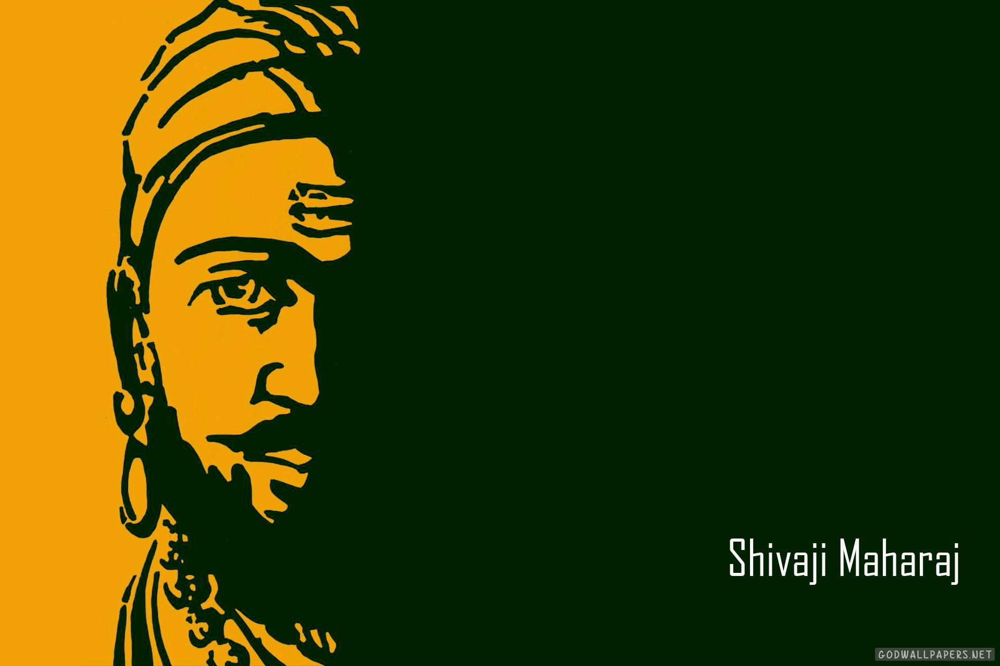

# CHHATRPATI SHIVAJI MAHARAJ 🚩🚩
# **Born :** 19 February 1630 
Shivneri Fort, Ahmadnagar Sultanate (present-day Maharashtra, India)
# **Died :**	 3 April 1680 (aged 50)
Raigad Fort, Mahad, Maratha Kingdom (present-day Maharashtra, India)

# **Spouse :**
1. Sai Bhonsale​(m. 1640; died 1659)​
2. Soyarabai ​(m. 1650)​
3. Putalabai ​(m. 1653)​
4. Sakvarbai ​(m. 1656)​
5. Kashibai Jadhav

# Issue
### **House :**	Bhonsle

# Father	
### Shahaji
# Mother	
### Jijabai
# Religion	
### Hinduism

 # information in detail
 Shivaji I (Shivaji Shahaji Bhonsale, 19 February 1630 – 3 April 1680)was an Indian ruler and a member of the Bhonsle dynasty.Shivaji carved out his own independent kingdom from the Adilshahi Sultanate of Bijapur that formed the genesis of the Maratha Confederacy. In 1674, he was formally crowned the Chhatrapati of his realm at Raigad Fort.Throughout his life, Shivaji engaged in both alliances and hostilities with the Mughal Empire, the Sultanate of Golkonda, the Sultanate of Bijapur and the European colonial powers. Following the Battle of Purandar, Shivaji entered into vassalage with the Mughal empire, assuming the role of a Mughal chief and undertaking military expeditions on behalf of the empire for a brief duration.Shivaji's military forces expanded the Maratha sphere of influence, capturing and building forts, and forming a Maratha navy. Shivaji established a competent and progressive civil administration with well-structured administrative institutions.

  He revived ancient Hindu political traditions, and court conventions and promoted the use of the Marathi and Sanskrit languages, replacing Persian at court and in administration. Praised for his chivalrous treatment of women,Shivaji employed people of all castes and religions, including Muslims and Europeans, in his administration and armed forces.Shivaji's legacy was to vary by observer and time, but nearly two centuries after his death he began to take on increased importance with the emergence of the Indian independence movement, as many Indian nationalists elevated him as a proto-nationalist, founder of the Swaraj movement, and hero of the Hindus.
 # Early LIfe
  shivaji was born in the hill-fort of Shivneri, near Junnar, which is now in Pune district. Scholars disagree on his date of birth; the Government of Maharashtra lists 19 February as a holiday commemorating Shivaji's birth (Shivaji Jayanti). Shivaji was named after a local deity, the Goddess Shivai Devi.

  Shivaji belonged to a Maratha family of the Bhonsle clan.Shivaji's father, Shahaji Bhonsle, was a Maratha general who served the Deccan Sultanates.His mother was Jijabai, the daughter of Lakhuji Jadhavrao of Sindhkhed, a Mughal-aligned sardar claiming descent from a Yadav royal family of Devagiri.His paternal grandfather Maloji (1552–1597) was an influential general of Ahmadnagar Sultanate, and was awarded the epithet of "Raja". He was given deshmukhi rights of Pune, Supe, Chakan, and Indapur to provide for military expenses. He was also given Fort Shivneri for his family's residence (c. 1590).

At the time of Shivaji's birth, power in the Deccan was shared by three Islamic sultanates: Bijapur, Ahmednagar, Golkonda, and the Mughal Empire. Shahaji often changed his loyalty between the Nizamshahi of Ahmadnagar, the Adilshah of Bijapur and the Mughals, but always kept his jagir (fiefdom) at Pune and his small army.

# Legacy
Shivaji's greatest legacy was laying the foundation for the Maratha Empire, which played a significant role in undermining the military and economic strength and prestige of the Mughal Empire.

Soon after Aurangzeb's death in 1707, Marathas started to capture Mughal dominions. By 1734, Marathas were firmly established in Malwa. By 1737 Marathas had carried out raids as far as Bundelkhand, Rajputana, the Doab, and defeated an imperial army outside walls of Delhi. Facing defeat and starvation of his army in 1738, the Nizam of Hyderabad, acting on the authority of the Mughal emperor, recognised Marathas as rulers of Malwa and sovereign of all territories between Narmada and Chambal.Stewart Gordon writes regarding the northward march of Marathas:

In the 1750s, the "frontier" extended north to Delhi. In this period, the Mughal government directly controlled little territory further than fifty miles from the capital. Even this was fiercely fought over. Jats and Rohillas disputed for the territory; factions fought for the throne, and the Afghan king, Ahmad Shah Abdali, periodically descended on the capital.

For the Marathas, probably the two most significant events of the whole chaotic period in Delhi were a treaty in 1752, which made them protector of the Mughal throne (and gave them the right to collect chauth in the Punjab), and the civil war of 1753, by which the Maratha nominee ended up on the Mughal throne.- (Cambridge History of India Vol. 2 Part 4 pp. 138 - 139)

At its peak, the Maratha empire stretched from modern-day Maharashtra, in the south, to the Sutlej river, in the north, and to Orissa, in the east. In 1761, the Maratha army lost the Third Battle of Panipat to Ahmed Shah Durrani of the Afghan Empire, which is considered a big setback for the Marathas. However, the Marathas soon recovered. Ten years after Panipat, Marathas regained influence in North India during the rule of Madhav Rao II.

In the first half of the 19th century, the British East India Company was increasing its strength in India. Charles Metcalfe, a British official and later acting governor-general, said in 1806:

India contains no more than two great powers, British and Maratha, and every other state acknowledges the influence of one or the other. Every inch that we recede will be occupied by them.

The Marathas remained the pre-eminent power in India until their defeat by the British in the Second and Third Anglo-Maratha wars (1805–1818), which left the company the dominant power in most of India.

# Seal
 ######   
 Seals were a means to confer authenticity on official documents. Shahaji and Jijabai had Persian seals. But Shivaji, right from the beginning, used Sanskrit for his seal.The seal proclaims: "This seal of Shiva, son of Shah, shines forth for the welfare of the people and is meant to command increasing respect from the universe like the first phase of the moon."

  # Images
  
  
  
  

  #

